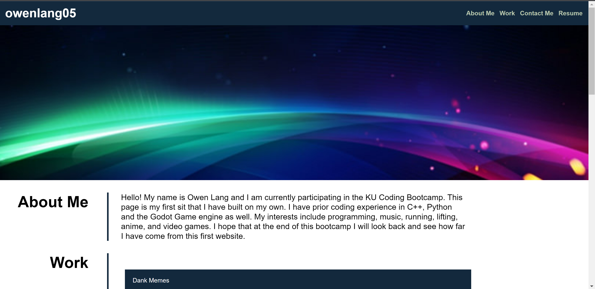

# Portfolio-Website

## Description

This is a portfolio website for my future projects. Right now there is just fake funny projects, although I have built tic-tac-toe in python before. I learned how to use CSS and HTML better while creating this website, I got better at flexbox as well.

## Usage

Go to the website at https://owenlang05.github.io/Portfolio-Website/

## License

See License in the Repo.

